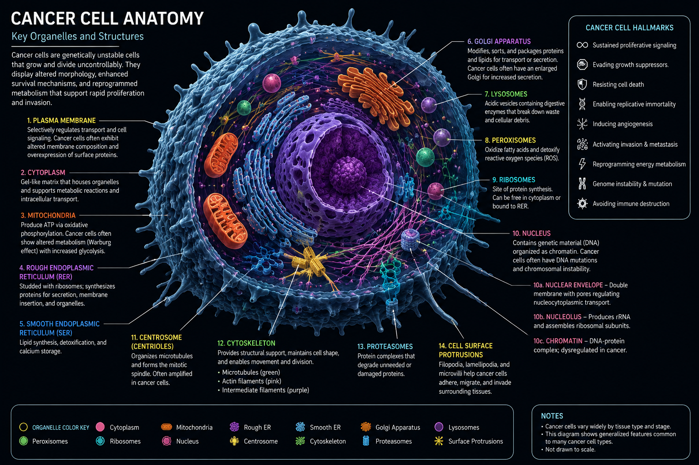

<div align="center">

# Quantum Oncology Benchmark

### Reproducible evaluation of classical and quantum machine learning for oncology research

[](https://github.com/raybeecham/quantum-oncology-benchmark/actions/workflows/ci.yml)
[](LICENSE)
[](pyproject.toml)
[](https://qiskit.org/)
[](MODEL_CARD.md)

</div>

<p align="center">
  
</p>

> [!IMPORTANT]
> **Research use only.** This project is not a medical device, diagnostic system, treatment recommendation, or clinical decision-support product. It does not claim that quantum computing improves cancer outcomes or that any benchmark result demonstrates quantum advantage.

## Overview

The **Quantum Oncology Benchmark** is an open, reproducible framework for evaluating classical machine-learning models and quantum-kernel methods on binary cancer-classification tasks.

The project is organized around a narrow, falsifiable question:

> Under a shared and auditable evaluation protocol, when does a quantum model perform differently from strong classical baselines, and what computational resources are required?

The benchmark treats negative and inconclusive results as useful evidence. It is designed to make data leakage, weak classical controls, hidden preprocessing, selective reporting, irreproducible experiments, and unsupported quantum-advantage claims harder to introduce.

## Current project status

The repository has moved beyond its initial software demonstration and now includes a reproducibility and statistical-evaluation foundation suitable for more disciplined benchmark studies.

| Milestone | Status | What is available now |
|---|---|---|
| Reproducible benchmark foundation | Complete | Classical and quantum-kernel runners, dataset fingerprints, configuration capture, environment provenance, and CI |
| Leakage and calibration hardening | Complete | Training-only preprocessing, selected-feature provenance, deterministic partition hashes, and training-only probability calibration |
| Statistical evaluation foundation | Complete | Repeat-level bootstrap intervals, exact McNemar comparisons, pairwise artifacts, and bounded evidence statements |
| Reproducibility contract | Complete | Normalized scientific equality checks that exclude operational variance and machine-precision noise |
| Classical nested cross-validation | Implemented | Locked balanced-accuracy endpoint, bounded inner search, untouched outer folds, predictions, search results, and reports |
| Full classical nested-CV reference run | Next | Run and review the five-outer-fold, three-inner-fold four-model reference configuration |
| Quantum nested cross-validation | Planned | Add a resource-bounded quantum-kernel protocol after the classical reference baseline is established |
| External oncology cohorts | Planned | Add documented cohort recipes and external validation after the benchmark methodology is stable |

The current benchmark supports **exploratory and methodological evidence**. It does not support clinical utility claims, external validity claims, or quantum-advantage claims.

## Project at a glance

<table>
<tr>
<td width="50%" valign="top">

### Classical evaluation

- Logistic regression
- RBF support-vector machine
- Random forest
- Histogram gradient boosting
- Repeated stratified holdouts
- Classical nested cross-validation
- Locked balanced-accuracy endpoint
- Bounded hyperparameter grids

</td>
<td width="50%" valign="top">

### Quantum baseline

- Qiskit fidelity statevector kernel
- Precomputed-kernel SVM
- Exact or shot-sampled simulation
- Training-only score calibration
- Circuit resource accounting
- Explicit physical-QPU status
- No automatic advantage claim
- Quantum nested CV deferred

</td>
</tr>
<tr>
<td width="50%" valign="top">

### Statistical evidence

- BCa bootstrap confidence intervals
- Exact paired McNemar tests
- Shared-partition comparison hashes
- Descriptive direction counts
- No invalid pooled holdout p-value
- Conservative evidence statements
- Sensitivity and specificity reporting
- Probability-quality metrics

</td>
<td width="50%" valign="top">

### Data and provenance

- Built-in public breast-cancer dataset
- Binary numeric CSV adapter
- Public GDC metadata manifests
- Dataset and partition fingerprints
- Selected-feature provenance
- Fold-level prediction artifacts
- Environment and commit metadata
- Reproducibility normalization

</td>
</tr>
</table>

## Why this project exists

Quantum machine learning in oncology is promising, but early-stage results are easy to overstate. Small datasets, data leakage, weak classical controls, simulator-only experiments, uncontrolled tuning, and selective reporting can make an experimental model appear more useful than it is.

This repository establishes a defensible baseline by requiring:

1. Explicitly declared positive classes and evaluation endpoints.
2. Identical evaluation partitions for directly compared models.
3. Preprocessing and feature selection fitted only on training data.
4. Strong classical comparators with documented tuning budgets.
5. Repeated or nested evaluation with retained prediction-level evidence.
6. Transparent uncertainty, paired disagreement, and calibration metrics.
7. Machine-readable provenance and deterministic configuration.
8. Explicit interpretation boundaries and refusal to infer advantage from one score.

A higher score on one split, one simulator run, or one small dataset is not quantum advantage.

## Evaluation modes

The repository provides two separate evaluation modes. They answer different methodological questions and produce different artifact schemas.

### 1. Repeated-holdout benchmark

```bash
qob benchmark --config configs/classical.yaml
```

Use this mode for software verification, exploratory comparisons, quantum-kernel experiments, and sensitivity analysis across deterministic holdout seeds.

It supports:

- classical-only, quantum-only, or combined model sets,
- shared train/test partitions,
- training-only preprocessing and calibration,
- repeated stratified holdouts,
- repeat-level bootstrap intervals,
- exact paired McNemar tests within each shared partition,
- statistical summaries and bounded evidence statements.

Repeated holdouts may reuse observations across test partitions. The benchmark therefore does not pool repeat-level p-values.

### 2. Classical nested cross-validation

```bash
qob nested-cv --config configs/nested-classical.yaml
```

Use this mode to estimate the performance of the configured classical model-selection procedure while keeping each outer test fold outside preprocessing, feature selection, calibration, hyperparameter selection, and refitting.

The reference protocol uses:

- five stratified outer folds,
- three stratified inner folds,
- balanced accuracy as the locked primary endpoint,
- eight selected features,
- four classical model families,
- deterministic seeds and single-worker searches,
- bounded, versioned hyperparameter grids.

For each outer fold, the inner search uses only the outer training partition. The selected pipeline is then refitted on the complete outer training partition and evaluated once on the untouched outer test partition.

For the RBF SVM, class predictions come from the selected pipeline. Probability scores come from a separately cross-validated clone fitted only on the outer training partition. Calibration does not replace the predictions used for balanced accuracy or McNemar comparisons.

See [Classical Nested Cross-Validation Protocol](docs/NESTED_CROSS_VALIDATION.md) for the complete method and limitations.

## Current capabilities

- Built-in public demonstration dataset: Wisconsin Diagnostic Breast Cancer.
- Malignant disease explicitly mapped to positive class `1`.
- CSV adapter for binary tabular cohorts, biomarkers, or externally prepared genomic features.
- Public GDC metadata manifest generator for reproducible TCGA cohort discovery.
- Train/test or outer-fold splitting before imputation, scaling, feature selection, or calibration.
- Four classical baselines and one optional Qiskit fidelity-kernel baseline.
- Repeated stratified holdouts and classical nested cross-validation.
- Locked primary endpoint and bounded inner hyperparameter search for nested CV.
- Per-split or per-fold selected features, partition hashes, class counts, seeds, and predictions.
- Oncology-oriented metrics:
  - balanced accuracy
  - sensitivity
  - specificity
  - precision
  - F1
  - ROC AUC
  - average precision
  - Brier score
  - log loss
- Repeat-level or outer-fold descriptive bootstrap intervals.
- Exact McNemar comparisons within shared test partitions.
- Deterministic reproducibility comparison with operational fields removed.
- JSON, CSV, Markdown, and Streamlit reporting.
- CI across Python 3.10 through 3.13, strict mypy, Qiskit smoke testing, and a real nested-CV CLI smoke run.

## Architecture

```text
Public demo dataset, validated CSV, or GDC-derived cohort metadata
                              │
                              ▼
                  Cohort validation and fingerprinting
                              │
               ┌──────────────┴──────────────┐
               │                             │
               ▼                             ▼
     Repeated-holdout mode          Classical nested-CV mode
               │                             │
    Shared deterministic split       Untouched outer test fold
               │                             │
    Training-only preprocessing      Inner search on outer train
               │                             │
       ┌───────┴────────┐            Locked selected pipeline
       ▼                ▼                     │
 Classical models   Quantum kernel            ▼
       │                │             One outer-fold evaluation
       └───────┬────────┘                     │
               └──────────────┬───────────────┘
                              ▼
        Metrics, uncertainty, paired comparisons, and provenance
                              │
                              ▼
        JSON, CSV, Markdown, prediction, and dashboard artifacts
```

Detailed design and governance documentation:

- [Architecture](docs/ARCHITECTURE.md)
- [Research Protocol](RESEARCH_PROTOCOL.md)
- [Statistical Evaluation](docs/STATISTICAL_EVALUATION.md)
- [Nested Cross-Validation](docs/NESTED_CROSS_VALIDATION.md)
- [Model Card](MODEL_CARD.md)
- [Data Sources](docs/DATA_SOURCES.md)
- [Data Governance](DATA_GOVERNANCE.md)

## Quick start

### 1. Create a virtual environment

```bash
python -m venv .venv
```

Windows PowerShell:

```powershell
.\.venv\Scripts\Activate.ps1
```

Linux, macOS, or WSL:

```bash
source .venv/bin/activate
```

### 2. Install the core benchmark

```bash
python -m pip install --upgrade pip
pip install -e ".[dev]"
```

### 3. Run the repeated-holdout classical benchmark

```bash
qob benchmark --config configs/classical.yaml
```

Artifacts are written to `reports/classical/`.

### 4. Run the classical nested-CV reference protocol

```bash
qob nested-cv --config configs/nested-classical.yaml
```

Artifacts are written to `reports/nested-classical/`.

### 5. Install and run the quantum benchmark

```bash
pip install -e ".[dev,quantum]"
qob doctor
qob benchmark --config configs/baseline.yaml
```

The default quantum model uses classical simulation. Reports explicitly record whether a physical QPU was used.

### 6. Launch the dashboard

```bash
pip install -e ".[dashboard]"
streamlit run app.py
```

## Common workflows

### Run a reduced nested-CV smoke experiment

```bash
qob nested-cv --config configs/nested-smoke.yaml
```

The smoke configuration uses two outer folds, two inner folds, logistic regression, and RBF SVM. It is intended for command and artifact validation, not substantive scientific interpretation.

### Select a subset of nested-CV models

```bash
qob nested-cv \
  --model logistic_regression \
  --model rbf_svm \
  --outer-folds 5 \
  --inner-folds 3 \
  --features 8 \
  --output reports/nested-logistic-svm
```

### Compare classical and quantum models on a bounded sample

```bash
qob benchmark \
  --model-set all \
  --features 4 \
  --max-samples 160 \
  --repeats 3 \
  --output reports/all-models
```

### Run the exact statevector quantum kernel

```bash
qob benchmark --model-set quantum
```

Omit `--quantum-shots` for exact statevector fidelity. Set it to a positive integer to simulate finite-shot sampling.

### Validate a prepared CSV

```bash
qob validate-csv cohort.csv \
  --target-column diagnosis \
  --positive-label malignant
```

### Run a CSV experiment

```bash
qob benchmark \
  --dataset csv \
  --csv-path cohort.csv \
  --target-column diagnosis \
  --positive-label malignant \
  --model-set all \
  --features 4
```

### Create a public GDC manifest for TCGA lung projects

```bash
qob gdc-manifest \
  --project TCGA-LUAD \
  --project TCGA-LUSC \
  --data-type "Gene Expression Quantification" \
  --workflow-type "STAR - Counts" \
  --sample-type "Primary Tumor" \
  --output manifests/tcga-lung-star-counts.csv
```

This command creates metadata and a `.query.json` receipt. It does not download genomic files.

## Output contracts

### Repeated-holdout artifacts

| Artifact | Purpose |
|---|---|
| `experiment.json` | Full configuration, dataset fingerprint, environment, split provenance, statistical analysis, and quantum-resource record |
| `summary.csv` | Aggregate metrics and confidence intervals across repeated splits |
| `runs.csv` | Per-model, per-repeat metrics and confusion counts |
| `pairwise_comparisons.csv` | Exact McNemar disagreement counts, test hashes, descriptive direction, and significance by repeat |
| `REPORT.md` | Human-readable method, results, evidence statement, and limitations |

The repeated-holdout experiment schema is currently `1.3`.

### Nested cross-validation artifacts

| Artifact | Purpose |
|---|---|
| `nested_experiment.json` | Complete nested-CV configuration, methodology, provenance, results, and environment record |
| `outer_fold_results.csv` | Selected parameters, selected features, partition hashes, final metrics, and score source by model and outer fold |
| `outer_fold_predictions.csv` | Hashed sample identifier, truth, class prediction, and positive-class score |
| `inner_search_results.csv` | Every bounded candidate, inner score, rank, and selected-candidate flag |
| `nested_summary.csv` | Aggregate outer-fold metrics and descriptive intervals |
| `nested_pairwise_comparisons.csv` | Exact paired disagreement results within each shared outer test fold |
| `NESTED_CV_REPORT.md` | Human-readable nested protocol, results, evidence statement, and limitations |

The nested-CV experiment schema is currently `nested-cv-1.0`.

All experiment payloads retain:

```json
{
  "quantum_advantage_claimed": false
}
```

This is intentional. The framework records comparative evidence; it does not convert a small benchmark difference into an advantage claim.

## Reproducibility contract

The benchmark retains dataset fingerprints, configurations, seeds, selected features, partition hashes, metrics, confidence intervals, paired comparisons, prediction evidence, and environment provenance.

For scientific replay checks, normalization removes fields expected to vary operationally:

- generation timestamps,
- output directories,
- artifact paths,
- measured execution times.

Finite floating-point values are canonicalized to 12 decimal places during comparison only. Stored JSON and CSV precision is not altered. This excludes meaningless machine-precision aggregation noise while preserving materially larger numerical differences.

## Data strategy

The built-in dataset is intended for software verification and methodological demonstration, not biomedical conclusions.

For more serious work, prepare a documented cohort outside the public repository and provide a binary tabular CSV containing:

- One row per independent subject or specimen.
- Numeric model features only.
- A binary target with a declared positive class.
- No names, medical record numbers, dates of birth, free text, or direct identifiers.
- A cohort-definition record and data dictionary.
- Documented authorization and an appropriate ethical or legal basis for use.

The CSV adapter validates shape and label encoding. It does not certify de-identification, scientific validity, representativeness, independence of rows, or lawful use.

Subject-grouped and site-grouped splitting are not yet implemented. Cohorts containing repeated subjects or site effects require an external preparation and validation process until those controls are added.

## What the project does not do yet

- Execute through a production physical-QPU adapter.
- Perform quantum nested cross-validation.
- Download controlled-access patient or genomic data.
- Enforce subject-grouped or site-grouped splitting.
- Validate a clinical biomarker.
- Perform prospective clinical evaluation.
- Provide external-cohort validation.
- Establish statistical superiority across independent cohorts.
- Establish quantum or clinical advantage.
- Recommend treatment, diagnosis, or patient-specific action.

These boundaries are deliberate.

## Scientific interpretation

A quantum result should be considered credible only when:

1. Quantum and classical models use identical evaluation partitions.
2. Preprocessing, feature selection, and calibration are fitted only on training data.
3. Classical baselines receive reasonable and documented tuning budgets.
4. Results are repeated across seeds or evaluated through a locked nested protocol.
5. Paired predictions, confidence intervals, and uncertainty are retained.
6. Circuit resources and execution mode are disclosed.
7. External or independently held-out data confirm the finding.
8. Another researcher can reproduce the result from the repository.

Nested cross-validation improves internal model-selection discipline. It does not replace external validation or independent replication.

Until stronger evidence exists, results should be described as exploratory benchmark evidence.

## Development

```bash
pip install -e ".[dev,quantum]"
ruff check .
mypy src
pytest
```

The GitHub Actions workflow runs:

- Ruff across Python 3.10, 3.11, 3.12, and 3.13.
- Strict mypy against the configured Python 3.10 target.
- Core tests across Python 3.10 through 3.13.
- A real nested-CV command and artifact smoke run on Python 3.12.
- A dedicated Qiskit quantum test and benchmark smoke run on Python 3.12.

## Roadmap from the current baseline

| Priority | Objective | Current state |
|---|---|---|
| 1 | Merge and run the full classical nested-CV reference protocol | Ready |
| 2 | Review outer-fold stability, selected parameters, selected features, and paired predictions | Next analysis milestone |
| 3 | Add subject-grouped and site-grouped split controls | Planned |
| 4 | Add documented TCGA cohort recipes and data-quality artifacts | Planned |
| 5 | Design a resource-bounded quantum nested-CV protocol | Planned after the classical reference baseline |
| 6 | Add external-cohort and independent replication workflows | Required before translational claims |
| 7 | Add physical-QPU execution adapters with backend snapshots and cost records | Future hardware milestone |
| 8 | Expand into drug-response, multi-omics, radiomics, and molecular workloads | Longer-term research scope |

See [ROADMAP.md](ROADMAP.md) for the broader version plan. The immediate engineering focus is the full classical nested-CV reference run and review of its fold-level evidence.

## Governance and safety

Read these documents before proposing substantive changes:

- [Contributing](CONTRIBUTING.md)
- [Governance](GOVERNANCE.md)
- [Security](SECURITY.md)
- [Data Governance](DATA_GOVERNANCE.md)
- [Research Protocol](RESEARCH_PROTOCOL.md)

Do not submit protected health information, controlled-access data, credentials, signed URLs, patient screenshots, or identifying clinical content in code, issues, pull requests, discussions, logs, or test artifacts.

## Citation

The repository includes a [`CITATION.cff`](CITATION.cff) file. When citing results, record the exact:

- repository commit
- evaluation mode and configuration
- dataset or manifest fingerprint
- random seeds and partition hashes
- dependency environment
- simulator or hardware execution mode

## Contributing

Contributions are welcome when they preserve the project’s scientific and safety boundaries. Methodological changes should include protocol updates, tests, migration notes, and a clear evidence-based rationale.

## License

Licensed under the [Apache License 2.0](LICENSE).
